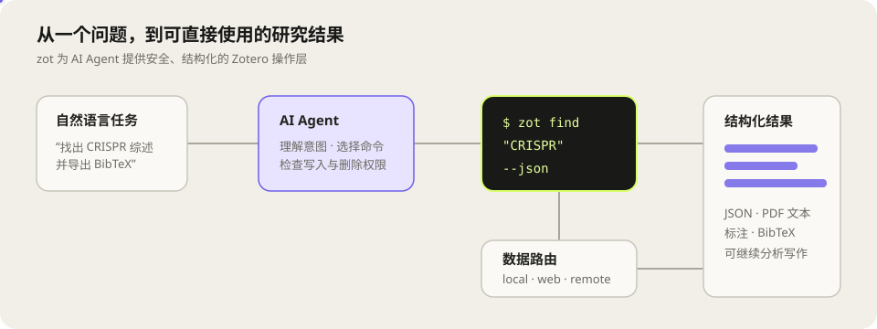

# zot

[](https://github.com/gqy20/zotero_cli/actions/workflows/ci.yml)
[](https://github.com/gqy20/zotero_cli/releases)
[](LICENSE)
[](https://go.dev/)

**AI 原生的 Zotero 命令行工具。** 为 Claude Code、Codex 等 AI agent 设计，让 AI 能直接操作你的 Zotero 文献库 — 检索、阅读 PDF、管理标注、导出引用数据，覆盖从文献调研到论文写作的完整科研工作流。

同时也支持终端手动使用和脚本自动化。

<p align="center">
  
</p>

## 目录

- [为什么用 zot](#为什么用-zot)
- [快速开始](#快速开始)
- [AI Agent 集成](#ai-agent-集成-claude-code--codex)
- [科研工作流](#科研工作流)
- [安装方式](#安装方式)
- [运行模式](#运行模式)
- [命令速查](#命令速查)

## 为什么用 zot

| 传统方式 | 用 zot + AI |
|----------|-------------|
| 手动在 Zotero UI 里翻找文献 | `zot find "关键词" --json` → AI 直接消费结构化结果 |
| 逐篇打开 PDF 找内容 | `zot find '"概念" OR 同义词*' --in fulltext --snippet` → 全库全文检索 |
| 查看论文参考文献 | `zot ref ITEMKEY --json` → 优先 PMC JATS，否则 PubMed + Europe PMC 补全 |
| 解析本地引用关系 | `zot ref resolve`，再用 `ref cited ITEMKEY` / `ref ctx ITEMKEY` 查询 |
| 搜索引用、语境与 PubMed 主题 | `zot ref find "query" --json`；用 `--in contexts|references|metadata|all` 限定 |
| 发现 PubMed 相关文献 | `zot ref related ITEMKEY --limit 20 --json` |
| 查看关联生物医学资源 | `zot ref links ITEMKEY --json`（合并 NCBI 与 Europe PMC） |
| Europe PMC 增强 | `zot ref cited ITEMKEY --external`；`zot ref entities ITEMKEY`；`ref links` 自动合并两套资源 |
| 开放科学画像 | `zot ref profile ITEMKEY --json` 查看预印本/正式版本、评价、基金、OA 和许可证 |
| 复制粘贴 BibTeX / RIS | `zot item export KEY --as bibtex` → AI 直接消费标准导出 |
| 标注散落在各处无法汇总 | `zot ann list KEY --json` → 双源（Zotero+PDF）统一输出，支持按类型/页码/作者过滤和分来源安全删除 |
| 批量打标签靠手点 | `zot item tag --items K1,K2,K3 --tag "to-read"` | 一条命令 |

> `ref` 的正式支持核心是 PMC/PubMed（NCBI）。`ref grobid` 仅为实验性、显式调用的 PDF 后备，不属于默认构建流程；公共演示端点不提供稳定性或配额保证。

完整的数据源优先级、Europe PMC 增强策略、索引字段、缓存和性能说明见 [引用索引与文献发现](docs/user/references.md)。

**核心设计原则：**

- **JSON 优先** — 业务命令支持统一的 `--json` envelope；帮助页和 shell completion 是明确的纯文本输出
- **Skill 自动发现** — 内置 `.claude/skills/`，Codex/Cursor 等可复用同一套说明文件
- **安全写操作** — 删除默认禁止、版本号乐观锁，防止 AI 误操作
- **本地能力优先** — hybrid 模式下本地 SQLite 全文检索、PDF 标注/笔记读写不走网络；remote 模式下 PDF 标注读写由 `zot serve` 代理并受服务端写/删权限保护

## 快速开始

### AI 助手一键配置（推荐）

在 **Claude Code** 或 **Codex** 中发送以下内容，AI 会自动完成全部安装和配置：

```
帮我安装并配置 zot CLI 工具，按顺序执行：

1. 从 GitHub Release 获取版本信息和下载链接：
   访问 https://github.com/gqy20/zotero_cli/releases/latest 获取最新版本号和各平台下载链接。
   （如果 GitHub 不可用，回退到七牛 CDN: https://qny.gqy20.top/github/zotero_cli/version.json）

2. 检测当前平台（Windows/macOS/Linux），创建 ~/.local/bin 目录（如不存在）并加入 PATH。
   根据平台从 GitHub 下载对应文件到 ~/.local/bin/：
   Windows -> 下载 windows_amd64 zip，重命名为 zot.exe
   macOS/Linux -> 解压对应 tar.gz 中的 zot 二进制
   chmod +x ~/.local/bin/zot（非 Windows）

3. 运行 zot version 验证安装成功后，向我索取 Zotero API Key 和 Library ID，
   然后初始化（mode=hybrid）并安装 PyMuPDF：
   zot config init --mode hybrid --library-type user --library-id <ID> --api-key <KEY> --pdf
   如果需要完全非交互，请同时传入 Zotero 数据目录：
   zot config init --mode hybrid --library-type user --library-id <ID> --api-key <KEY> --data-dir <ZOTERO_DATA_DIR> --pdf

4. 运行 zot config check 和 zot lib show --json 验证全部就绪。
```

**你只需要做一件事**：在第 3 步时提供你的 Zotero API Key 和 Library ID。其余全部由 AI 自动完成。


### 手动安装

**Windows：**

| 来源 | 地址 |
|------|------|
| GitHub | 从 [Releases](https://github.com/gqy20/zotero_cli/releases) 下载 `zot.exe` |
| **七牛 CDN（国内推荐）** | 从 [CDN](https://qny.gqy20.top/github/zotero_cli/) 下载对应版本的 `zot_*_windows_amd64.exe` |

放到 `~/.local/bin/` 或任意已在 PATH 中的目录。

**macOS：**

```bash
brew install gqy20/tap/zotcli
```

**Linux：**

```bash
# 方式一：GitHub 下载
curl -fsSL https://github.com/gqy20/zotero_cli/releases/latest/download/zot-linux-amd64 -o ~/.local/bin/zot && chmod +x ~/.local/bin/zot

# 方式二：七牛 CDN 下载（国内更快）
_INFO=$(curl -sL https://qny.gqy20.top/github/zotero_cli/version.json)
# 从 JSON 提取 base_url 和对应平台的文件名，然后下载解压
curl -fsSL "$(echo $_INFO | python3 -c 'import sys,json; d=json.load(sys.stdin); print(d["base_url"]+d["files"]["linux_amd64"])')" \
  | tar xz -C ~/.local/bin zot && chmod +x ~/.local/bin/zot

# 方式三：Homebrew
brew install gqy20/tap/zotcli
```

**后续步骤（所有平台相同）：**

```bash
zot version              # 验证安装
zot config init                 # 交互式配置（mode 选 hybrid）

# 远程模式初始化（连接局域网内一台运行 `zot serve` 的机器）
zot config init --mode remote --server-addr http://192.168.1.100:8021
zot config init --mode remote --server-addr http://host:8021 --library-id ID --api-key KEY
zot config check       # 校验配置
zot lib show --json        # 一站式库概览
```

`zot config init` 配置项说明（使用 `--json` 时不会交互，必须一次提供当前模式所需的完整参数）：

| 配置项 | 获取方式 |
|--------|----------|
| `ZOT_API_KEY` | [zotero.org/settings/keys](https://www.zotero.org/settings/keys) 创建 API key |
| `ZOT_LIBRARY_ID` | Zotero 首页 → 右键库 → Advanced → 数字 ID |
| `ZOT_DATA_DIR` | Zotero → 编辑 → 首选项 → 高级 → 数据目录路径 |
| `ZOT_MODE` | 推荐 `hybrid`（本地优先 + Web 回退） |
| `ZOT_SERVER_ADDR` | 远程模式需要，运行 `zot serve` 的地址（如 `http://192.168.1.100:8021`） |

`ZOT_DATA_DIR` 使用绝对路径；`zot config init` 会自动把输入路径规范化为绝对路径，手工配置的相对路径会被拒绝，避免从不同工作目录启动时指向不同文献库。

> local/hybrid 下 `zot config init` 会询问是否安装 PyMuPDF，也可事后 `zot config init --pdf` 安装或 `zot config init --check-pdf` 诊断。
>
> 完整配置指南（含 API Key 获取、文件重命名模板、推荐插件）：见 [配置指南](docs/user/zotero-setup-guide.md)。

### 源码构建

```bash
git clone https://github.com/gqy20/zotero_cli.git && cd zotero_cli
go build -o zot.exe ./cmd/zot     # Go 1.26+，无 CGO 依赖
# 远程模式服务端就是同一个二进制：
#   zot serve                     # 起服务端（默认 :8021）
# 想要带 Web UI 的版本（需先在 web/ 下 npm run build）：
#   go build -tags embed -o zot.exe ./cmd/zot
```

## AI Agent 集成（Claude Code / Codex）

zot 内置 **Skill 文件**，让 Claude Code、Codex 等 AI 助手开箱即懂 Zotero 操作。当然你也可以直接在终端用 `zot`，Skill 只是用 AI 时的便捷增强层。

### 内置 Skill 包含什么

`.claude/skills/zotero-cli/` 目录：

| 文件 | 作用 |
|------|------|
| `SKILL.md` | 主文件：核心命令速查 + 工作流规则 + 写操作安全策略（~185 行） |
| `reference.md` | 详细参考：决策树 / 常见陷阱 / 默认值 / JSON 格式 / 模式差异表 |
| `examples/` | `find` 和 `show` 的 JSON 输出示例 |

AI 加载后自动知道：该用什么命令、哪些参数必填、`--json` 何时加、写操作前要检查什么权限。

### 安装 Skill

**推荐：让 AI 助手帮你装**

在 Claude Code / Codex 中运行 `zot config init`，初始化完成后会自动提示安装 skill，直接复制执行即可。

**手动安装**

```bash
mkdir -p ~/.claude/skills/zotero-cli/examples

# GitHub（默认）
_RAW="https://raw.githubusercontent.com/gqy20/zotero_cli/master"
# Gitee（国内更快，仅限源码文件，不含 Release 二进制）
# _RAW="https://gitee.com/gqy20/zotero_cli/raw/master"

curl -fsSL ${_RAW}/.claude/skills/zotero-cli/SKILL.md \
  -o ~/.claude/skills/zotero-cli/SKILL.md
curl -fsSL ${_RAW}/.claude/skills/zotero-cli/reference.md \
  -o ~/.claude/skills/zotero-cli/reference.md
curl -fsSL ${_RAW}/.claude/skills/zotero-cli/examples/find-output.md \
  -o ~/.claude/skills/zotero-cli/examples/find-output.md
curl -fsSL ${_RAW}/.claude/skills/zotero-cli/examples/show-output.md \
  -o ~/.claude/skills/zotero-cli/examples/show-output.md
```

> **Gitee 镜像说明**：Gitee 同步了仓库源码（Skill 文件、文档等），但 **不会同步 GitHub Releases 的二进制附件**。因此 Release 下载只能用 GitHub；Skill 文件/文档可切换到 Gitee raw 源加速。

也可在浏览器打开 [skill 目录](https://github.com/gqy20/zotero_cli/tree/master/.claude/skills/zotero-cli)（或 [Gitee 镜像](https://gitee.com/gqy20/zotero_cli/tree/master/.claude/skills/zotero-cli)），逐个文件点 **Raw** 后另存为。4 个文件建议全部下载。

**前提：** 确保已安装 `zot` 并完成 `zot config init` 配置（见上方[快速开始](#快速开始)）。Skill 只是指令文件，实际执行依赖 `zot` 二进制。

验证：在 Claude Code 中说"搜一下我的文献"，AI 应自动调用 `zot find ... --json`。

### 用自然语言操作

```text
你说的                                    → AI 调用的命令
─────────────────────────────────────────────────────────────
"搜 CRISPR 基因编辑相关文献"              → zot find "CRISPR gene editing" --tag 基因编辑 --json
"导出最近半年为 bibtex"                   → zot find --all --date-after 2025-10 --json > selected.json；zot export --from selected.json --as bibtex
"看这篇的 PDF 标注"                       → zot ann list KEY --json
"导出这篇为 BibTeX"                       → zot item export KEY --as bibtex --json
"查看条目元数据中的关系字段"               → zot item show KEY_A --json
"找这篇的补充表格/数据附件"                → zot item supp KEY --json
"提取论文图表"                            → zot pdf figs KEY -o ./figures --json
```

AI 自动处理：追加 `--json`、省略冗余 `--all`、写前检查权限、删除前确认、标注优先 Mode 1.5。

### 自定义你的 Skill

内置 Skill 是起点，不是限制。你可以基于它定制自己的工作流：

```bash
# 复制一份作为定制基础（从已安装位置或项目目录）
cp -r ~/.claude/skills/zotero-cli ~/.claude/skills/zotero-cli-custom

# 编辑 SKILL.md，加入你的习惯：
#   - 固定常用标签或收藏夹
#   - 预设导出格式和目标目录
#   - 加入领域特定的检索模板（如 "帮我找近两年 Nature/Cell 上关于 XX 的综述"）
#   - 定义多步骤工作流（如 文献调研→筛选→导出→生成报告）
```

自定义场景举例：

- **课题组共享模板**：预设团队收藏夹 key、统一标签体系、批量导出格式
- **写作辅助流**：定义"选题调研→文献筛选→标注提取→引用数据导出"的标准流程
- **期刊投稿追踪**：结合 `journal_rank` 字段自动筛选目标期刊分区

Skill 文件遵循 [Agent Skills 开放标准](https://github.com/anthropics/skills)，也兼容 Codex、Cursor 等支持 skill 机制的 AI 工具。

## 科研工作流

### 文献调研

```bash
# 关键词检索，返回结构化 JSON
zot find "hybrid speciation" --json

# 按时间范围筛选
zot find "CRISPR" --date-after 2023 --date-before 2025 --json

# 最近入库（按 Zotero dateAdded，而不是发表日期）
zot find --sort dateAdded --order desc --limit 10 --json

# 某个月发表的文献
zot find --all --date-after 2026-03 --date-before 2026-03 --sort date --order desc --json

# 按标签过滤（AND / OR）
zot find "基因编辑" --tag "高引用" --tag "综述" --json
zot find "基因编辑" --tag "高引用" --tag-any --json

# 高级过滤：收藏夹、排除标签、附件名、最近修改
zot find "CRISPR" --collection ABC123 --exclude-tag "已读" --attachment-name PDF --modified-within 30d --json

# 批量定位本地附件异常
zot find --missing-attachment --json
zot find --bad-attachment-name --json

# 全文搜索 PDF 内容（local / hybrid）；QUERY 直接使用 SQLite FTS5 语法
zot find '"同源多倍体" OR autopolyploid*' --in fulltext --snippet --json
zot find "同源多倍体" --in metadata --json  # 仅标题/作者/标签等元数据，也是默认范围
# 普通检索默认限制 100 条；snippet / --full 默认限制 20 条
zot find '"同源多倍体"' --in fulltext --snippet --limit 200 --json
```

显式 `--limit N` 覆盖默认值；`--all` 取消上限，二者互斥。metadata 范围允许省略 QUERY，因此 `zot find` 默认浏览前 100 条。JSON 的 `meta` 会返回 `returned`、`limit`、`offset`、`has_more` 和可选的 `next_offset`，便于调用方继续翻页。

### PDF 阅读与标注

```bash
# 提取 PDF 正文供 AI 分析（PyMuPDF 优先 → ft-cache 回退 → pdfium WASM 兜底）
zot pdf text KEY --json                         # 默认返回 content.txt / chunks.json 缓存路径
zot pdf text KEY --json --pages 3-8 --grep methods --max-chars 12000
zot pdf text KEY1 KEY2 --json --grep "gene\s+flow|introgression"
zot pdf text --collection "研究/植物/栗属" --json --grep "gene\s+flow|introgression"
zot pdf text KEY -o ./markdown
zot pdf text --all -o ./markdown --json

# 查找本地 Zotero 已保存的 Supplementary / Source data / 表格数据附件
zot item supp KEY --json
zot item supp KEY --online --json
zot item supp --all --json --limit 50
zot file show ATTKEY --json
zot file show --item KEY --json
zot file show --item KEY --health --json

# 提取论文图表（支持缓存、多 PDF 附件、低质量误检过滤和每页上限）
zot pdf figs KEY --json
zot pdf figs KEY1 KEY2 --workers 8 --output-dir ./figures --json
zot pdf figs --all --workers 8 --output-dir ./figures --json

# 查看 PDF 标注（双源：Zotero 阅读器 DB 标注 + PDF 文件内标注）
zot ann list KEY --json
zot ann list KEY --type highlight --page 3 --json   # 按类型/页码过滤
zot ann list KEY --author "User" --json              # 按作者过滤
zot ann list KEY --attachment ATTACHMENT_KEY --json # 多 PDF 时精确选择附件

# 写入标注到 PDF（推荐 Mode 1.5：单页搜索，精准定位）
zot ann new KEY --page 4 --text "GATK" --color red --comment "关键方法"
zot ann new KEY --text "speciation" --type underline     # 下划线
zot ann new KEY --page 3 --rect 100,200,350,220         # Mode 2: 精确坐标
zot ann new KEY --attachment ATTACHMENT_KEY --page 3 --text "GATK"

# 删除前先预览精确候选；必须显式选择来源
zot ann delete KEY --source zotero --type highlight --dry-run --json
zot ann delete KEY --source zotero --type highlight --yes --json
zot ann delete KEY --source pdf --attachment ATTACHMENT_KEY --page 5 --author "User" --yes --json

# 在 Zotero 阅读器中打开 PDF（跳转到指定页）
zot pdf open KEY --page 5

# 在 Zotero 主界面选中该条目
# `select` 是已退出稳定 CLI 的桌面端专用入口；请在 Zotero Desktop 中定位条目
```

PDF 导入完成后会对本次最终保留的附件执行增量全文索引，因此新文献无需再次运行全库 `index build` 即可参与全文检索。指定收藏夹、重复附件清理和增量索引共享同一个最终附件 key，不会索引已清理的重复记录。`find --snippet` 的 JSON 只返回轻量条目信息和 `matched_chunk` 证据，不复制摘要、附件、笔记或完整 Item；命中上下文以实际命中位置为中心，最多约 1200 个 Unicode 字符，并包含页码、附件 key 和坐标。`pdf text --grep` 默认按不区分大小写的 Go 正则解析，有分页缓存时按附件和命中页返回 `match_count`、页码与相邻上下文。`pdf text --collection` 接受收藏夹 key、唯一名称或完整层级路径。检索保持只读，不会自动创建标注。local/hybrid 下无过滤条件的 `pdf text` 默认只返回项目全文缓存的 `content_path` 和可选 `chunks_path`，调用方直接读取该文件；只有 `--grep`、`--pages`、`--max-chars` 才返回文本子集，只有显式 `--output-dir` 才生成 Markdown。缓存和 FTS 索引都会核对 PDF 的路径、大小和高精度修改时间；附件被替换后旧正文不会继续命中。remote 模式因客户端无法访问服务端本地路径，仍返回正文。

#### 与 Zotero 桌面端联动

zot 不是独立工具，它直接读写你的 **Zotero 本地数据目录**，并通过 `zotero://` 协议与运行中的 Zotero 桌面端交互：

| 命令 | 联动方式 | 效果 |
|------|----------|------|
| `zot pdf open KEY` | `zotero://open-pdf` 协议 | 在已运行的 Zotero **阅读器**中打开 PDF，支持页码跳转 |
| `zot ann list KEY` | SQLite + PyMuPDF 双源读取 | 同时获取 DB 层标注 **和** PDF 文件内嵌入的标注 |
| `zot ann new KEY` | PyMuPDF 事务式写入 PDF | 在临时副本中完成 3 种定位模式，验证后替换原文件 |
| `zot ann delete KEY --source zotero|pdf` | 分来源删除 | Zotero 标注按 item key 走 Web API；PDF 标注按 xref 在临时副本中修改并验证 |

在 `remote` 模式下，`ann list/new` 和 `ann delete --source pdf` 会通过远端 `zot serve` 在服务器侧读取或修改 PDF，并受服务端权限门控。`ann delete --source zotero` 使用标准 Zotero Web API，需要客户端配置 `ZOT_API_KEY` + `ZOT_LIBRARY_ID`。

条目有多个 PDF 时默认使用第一个 PDF；`ann list/new/delete` 均可通过 `--attachment ATTACHMENT_KEY` 精确选择。`ann new` 非预览写入若没有匹配到文本或有效页码会返回错误，且不会改动原 PDF；`--dry-run` 允许零匹配，用于检查定位条件。

数据来源：

- **Zotero Reader 标注** → 读取 `zotero.sqlite` 的 `itemAnnotations` 表（含你手动添加的高亮、笔记、时间戳）
- **PDF 文件内标注** → 通过 PyMuPDF 扫描 `storage/` 目录下的 PDF 二进制数据（含位置、颜色、作者信息）
- **附件路径解析** → 自动将 Zotero 内部路径映射为本地文件系统真实路径

### 笔记整理与导出

```bash
# 查看条目完整信息（含标注、附件、笔记）
zot show KEY --json

# 创建子笔记（hybrid 自动选择路径）
echo '{"itemType":"note","parentItem":"KEY","note":"<p>我的笔记</p>"}' > note.json
zot item new --from note.json --if-version N --json

# 查询文献间的显式关系
zot item show KEY --json

# 先检索，再把结构化结果交给导出
zot find --collection COLLKEY --all --json > selected.json
zot item export --from selected.json --as csljson

# 导出标准格式，供论文写作工具或 AI 后处理
zot item export KEY --as bibtex --json
zot find --collection COLLKEY --all --json | zot item export --from - --as ris
zot item export KEY --as csljson --json
```

### 库管理

```bash
zot coll list --json         # 收藏夹列表
zot tag list --json                # 所有标签
zot tag clean --match '^[\x00-\x7F]+$' --max-items 1 --json  # 预览低频自动英文标签
zot lib stats --json               # 库统计
zot lib log --kind items --since 0 --json  # 版本变更记录
```

## 安装方式

| 平台 | 方式 | 命令 |
|------|------|------|
| **macOS / Linux** | Homebrew（推荐） | `brew install gqy20/tap/zotcli` |
| **Windows** | 手动下载 | [GitHub Releases](https://github.com/gqy20/zotero_cli/releases) 或 [七牛 CDN](https://qny.gqy20.top/github/zotero_cli/) → `zot.exe` 放入 PATH |
| **macOS / Linux** | 手动下载 | [GitHub](https://github.com/gqy20/zotero_cli/releases) 或 [七牛 CDN](https://qny.gqy20.top/github/zotero_cli/) → `chmod +x zot && mv zot /usr/local/bin/` |
| **任意平台** | 源码构建 | `git clone https://github.com/gqy20/zotero_cli.git`（国内可用 `https://gitee.com/gqy20/zotero_cli.git`）→ `go build -o zot ./cmd/zot` |

将可执行文件放入 PATH 目录即可全局使用：

- Windows: `C:\Users\<用户名>\.local\bin\`
- macOS/Linux: `/usr/local/bin/` 或 `~/.local/bin/`

> 自定义目录加入 PATH：Windows 在系统环境变量中添加；macOS/Linux 在 shell 配置文件中追加 `export PATH="$HOME/.local/bin:$PATH"`。

## 运行模式

| 模式 | 数据源 | 需要 | 适用场景 |
|------|--------|------|----------|
| `web` | Zotero Cloud API | API key | 远程检索、云端管理 |
| `local` | 本地 SQLite + storage/ | ZOT_DATA_DIR | 离线操作、PDF 处理、全文搜索 |
| `hybrid`（推荐） | 本地优先，Web 回退 | 两者都要 | 日常使用，兼顾速度与完整性 |
| `remote` | HTTP → 远端 `zot serve` (port 8021) | ZOT_SERVER_ADDR | 同服务器端模式，局域网访问；PDF 标注读写走服务器 |

通过 `ZOT_MODE` 环境变量或 `zot config init` 设置。hybrid 模式下：
- **读操作**：本地优先（全文检索、PDF 标注读取）不误回退 Web
- **写操作**（笔记）：Zotero 未运行时走 SQLite 直写（~50ms），运行时自动 fallback Web API

remote 模式下：
- **读操作**：经由远端 `zot serve` 代理
- **PDF 标注读写**：经由 `zot serve` 在服务端执行

不想让远程服务一直开着？用 `zot sync` 把整库一次性同步到本地，之后断网用 `local` 模式工作：

```bash
# 服务端：在有 Zotero 数据的机器上起服务
zot serve                               # 默认 :8021

# 客户端：地址由 config 管理；同步到默认镜像目录（sqlite + 所有附件）
zot config init --mode remote --server-addr http://192.168.1.50:8021
zot sync
zot sync status             # 快速检查本地副本和 SQLite
zot sync status --full      # 完整 SQLite + 上次 manifest 校验
# 之后离线使用；默认自动识别 ~/.zot/sync
zot --mode local find ...
```

`zot sync` 是单向增量拉取：拉取原始 `zotero.sqlite`（数据库）、`storage/` 中的 imported PDF/附件、可解析的 `linked_file` 外部附件，以及 `.zotero_cli/fulltext/` 全文索引。外链附件复制到隔离的镜像目录，并通过 attachment key 映射供复制后的 SQLite 无感读取，不改写数据库中的原始路径。新增和变化的文件会下载；远端删除不会清理本地历史附件或全文缓存，SQLite 的 WAL/SHM/journal sidecar 则始终按当前远端数据库状态精确处理。源端暂时缺失的外链文件会被标记为 unavailable；若本地已有旧副本，继续保留并标记 stale。同步后可直接运行 `zot --mode local ...`，全文检索和 PDF 操作均使用镜像；中断的大附件会续传。
- **普通 Web API 写操作**：仍需 remote+web 配置（`ZOT_API_KEY` + `ZOT_LIBRARY_ID`）

## 命令速查

| 类别 | 命令 | 说明 |
|------|------|------|
| **检索** | `find` | 关键词/全文搜索，支持日期/标签/收藏夹/附件/类型等 20+ 过滤选项，输出含 `date_added` / `abstract` 字段 |
| **查看** | `show` | 条目详情（含标注/附件/笔记/摘要） |
| **列表** | `item list` | 按范围、类型和分页列出条目 |
| **关系** | `ref related` | 查询相关文献 |
| **PDF** | `pdf text` | 提取 PDF 正文 |
| **PDF** | `item supp` | 查找本地已保存的补充材料、Source data、表格/数据附件 |
| **PDF** | `file show` | 检查本地附件健康状态，并预览 `.xlsx` 附件的 sheet、表头和前几行 |
| **PDF** | `pdf figs` | 提取论文图表（缓存、多 PDF 附件、低质量误检过滤） |
| **标注** | `ann list` / `ann new` / `ann delete` | 读取、写入和删除 PDF 标注 |
| **PDF** | `pdf open` | 在 Zotero 阅读器中打开 |
| **导出** | `export` | BibTeX / RIS / CSL-JSON |
| **写操作** | `item new` / `item edit` / `item delete` / `item import` | 条目 CRUD；通过本机 Zotero 导入 PDF |
| **标签** | `item tag` / `item untag` | 批量标签管理 |
| **收藏夹** | `coll list` / `coll new` | 收藏夹查看与创建 |
| **配置** | `config init` / `config show` / `config check` | 配置管理 |

`item import --collection` 接受收藏夹 key、唯一名称或完整层级路径（例如 `研究/植物/栗属`）。如果 Zotero 桌面端未启动，导入命令会给出明确的启动提示；`config check` 也会报告桌面 Connector 是否可用。
| **其他** | `lib stats` / `tag list` / `note list` / `search list` | 库信息查看 |

完整选项说明见 [命令参考](docs/user/commands.md)，AI Agent 使用规范见 [快速入门](docs/user/quickstart.md)，技术架构见 [架构概览](docs/architecture/overview.md)。完整文档导航见 [文档中心](docs/README.md)。

Licensed under the [MIT License](LICENSE).
