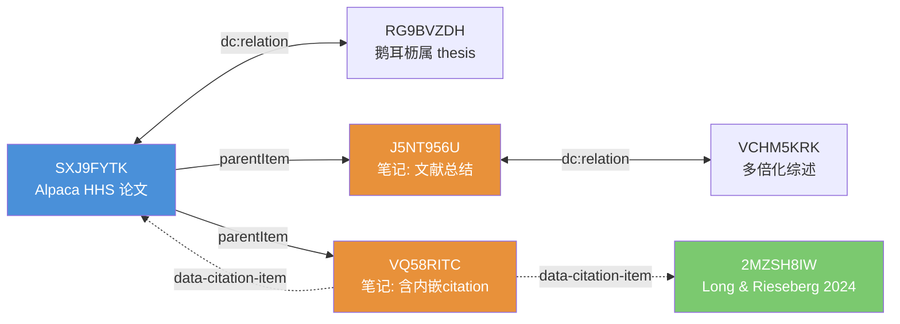

# Relate 命令增强方案

> 基于实测验证（2026-04-22），针对 `zot relate` 命令的完整分析与优化规划。

---

## 一、现状

### 1.1 当前能力

```bash
zot relate <item-key> [--json]   # 查询条目的显式关系
```

- **Local/Hybrid**：从 SQLite `itemRelations` 表读取，支持 outgoing + incoming 双向查询
- **Web**：返回 `ErrUnsupportedFeature`，完全不可用
- **输出**：JSON 或纯文本，包含 predicate / direction / target(key, itemType, title)

### 1.2 三层关联机制（实测确认）

Zotero 中存在**三种独立的关系/关联机制**，分别存储在不同位置：

```
┌─────────────────────────────────────────────────────────────────────┐
│ ① parentItemID — 父子层次（结构归属）                                │
│    表: itemNotes.parentItemID / itemAttachments.parentItemID         │
│    含义: 笔记/附件 → 所属论文                                        │
│    CLI 覆盖: ✅ notes 返回 parent_item_key                          │
│    Zotero UI: ✅ 侧边栏树形结构                                      │
├─────────────────────────────────────────────────────────────────────┤
│ ② itemRelations — 显式关系（用户手动建立）                            │
│    表: itemRelations(itemID, predicateID, object URI)               │
│    含义: 任意条目 ↔ 任意条目（论文↔论文、笔记↔论文、笔记↔笔记）       │
│    CLI 覆盖: ⚠️ 仅 local/hybrid，仅查自身 itemID                      │
│    Zotero UI: ✅ 论文详情页 + 笔记编辑器底部 "Related" 面板            │
├─────────────────────────────────────────────────────────────────────┤
│ ③ 内嵌 Citation — 笔记正文中的引用链接                                 │
│    存储: 笔记 HTML 的 data-citation-items 属性 (JSON)                │
│    含义: 用户在笔记中通过 Zotero 引用插件插入的文献引用               │
│    CLI 覆盖: ❌ 完全未解析                                            │
│    Zotero UI: ✅ 笔记中渲染为可点击的引用气泡 + Scite Smart Citations │
└─────────────────────────────────────────────────────────────────────┘
```

### 1.3 实测案例

以论文 **SXJ9FYTK** (`Hybrid origin of alpaca`) 为例，三层关系同时存在：

| 层 | 源 | 目标 | 类型 |
|----|------|------|------|
| ② itemRelations | SXJ9FYTK (论文) | RG9BVZDH (鹅耳枥属和铁木属系统发育基因组学研究) | dc:relation 双向 |
| ② itemRelations | J5NT956U (笔记) | VCHM5KRK (多倍化和驯化研究进展与展望) | dc:relation 双向 |
| ③ 内嵌 citation | VQ58RITC (笔记) | SXJ9FYTK + 2MZSH8IW (Long & Rieseberg 2024) | data-citation-items |

**关键发现**：

1. **论文和笔记都可以有 itemRelations** — Zotero UI 在两层都暴露了 Related 面板
2. **同一篇论文的不同笔记可以有不同的 relations** — J5NT956U 有，VQ58RITC 没有
3. **内嵌 citation 是第三种独立数据源** — 存储在笔记 HTML 内容中，不是数据库级别的 relation
4. **Snapshot 缓存存在时序不一致问题** — 同一 snapshot 下，先查 A→B 可能空，再查 B→A 能看到

---

## 二、缺陷清单

> **状态：全部已解决 ✅** (2026-04-22)

| # | 缺陷 | 严重度 | 状态 | 解决方案 |
|---|------|--------|------|----------|
| D1 | Web 模式返回 `ErrUnsupportedFeature` | P0 | **✅ 已修复** | Web API v3 `data.relations` 解析 + Hybrid fallback 开启 |
| D2 | Target 信息仅 key/type/title | P1 | **✅ 已修复** | ItemRef 扩展 date/creators/tags 字段，标量子查询避免笛卡尔积 |
| D3 | 不递归聚合子条目 relations | P0 | **✅ 已修复** | `--aggregate` 模式：self + notes + citations 三层聚合 |
| D4 | 无写入能力（add/remove） | P1 | **✅ 已修复** | Local SQLite 写入 + `--dry-run` 预览 + `ZOT_ALLOW_WRITE` 安全模型 |
| D5 | 无 predicate 过滤 | P2 | **✅ 已修复** | `--predicate PRED` 参数，支持 JSON/文本/DOT 三种输出模式 |
| D6 | 笔记内嵌 citation 未解析 | P1 | **✅ 已修复** | 正则提取 `data-citation-items`（含 URL 编码处理）+ URI → key 解析 |
| D7 | Snapshot 缓存时序不一致 | P0 | **✅ 已修复** | `snapshotStale` 字段 + 文本/JSON 双模式警告 |
| D8 | Hybrid fallback 禁止 get_related 回退 | P1 | **✅ 已修复** | `shouldFallbackToWeb(get_related)` 改为 true |

---

## 三、优化方案

### 3.1 P0 — 核心功能补全

#### 3.1.1 Web API 支持 (~100 行)

**目标**：让 `zot relate` 在 web 和 hybrid 模式下正常工作。

**依据**：Zotero Web API v3 文档确认：
- `GET /items/{key}` 返回的 `data.relations` 字段包含所有显式关系
- 格式为 `{"dc:relation": ["http://zotero.org/users/{uid}/items/{key}"], ...}`
- 写入通过 `PATCH /items/{key}` 的 `relations` 字段

**改动点**：

| 文件 | 改动内容 |
|------|----------|
| `zoteroapi/types.go` | `apiItemData` 新增 `Relations map[string][]string` 字段 |
| `zoteroapi/client_read.go` | `mapItem()` 函数中解析 `Relations` → 提取 URI 中的 itemKey |
| `backend/web.go` | `WebReader.GetRelated()` 从 `GetItem()` 结果中提取 relations，替换当前 stub |
| `backend/reader.go:311` | `shouldFallbackToWeb(get_related)` 返回值改为 `true` |

**数据流**：
```
GET /items/SXJ9FYTK → JSON.data.relations = {"dc:relation": ["http://.../items/RG9BVZDH"]}
  ↓ 解析 URI (http://zotero.org/users/{uid}/items/{KEY} → KEY)
[]domain.Relation{
  Predicate: "dc:relation",
  Direction: "outgoing",
  Target: {Key: "RG9BVZDH", ItemType: "thesis", Title: "..."}
}
```

#### 3.1.2 递归聚合子条目 Relations (~80 行)

**目标**：`zot relate KEY --aggregate` 返回该条目及其所有子笔记/附件的完整关系网络。

**动机**：实测证明用户在笔记上建立的关系（如 J5NT956U → VCHM5KRK）是核心使用场景，但当前查论文本身看不到这些关系。

**新输出格式**：
```bash
$ zot relate SXJ9FYTK --aggregate --json
{
  "ok": true,
  "command": "relate",
  "data": {
    "self": [
      {"predicate": "dc:relation", "direction": "outgoing",
       "target": {"key": "RG9BVZDH", "title": "鹅耳枥属...", ...}}
    ],
    "notes": [
      {
        "source": {"key": "J5NT956U", "preview": "文献总结：羊驼的杂交起源..."},
        "relations": [
          {"predicate": "dc:relation", "direction": "outgoing",
           "target": {"key": "VCHM5KRK", "title": "多倍化和驯化研究进展与展望", ...}}
        ]
      }
    ],
    "citations": []   // P1 阶段填充
  },
  "meta": {...}
}
```

**SQL 逻辑**：
```sql
-- 自身关系 (已有)
SELECT * FROM itemRelations WHERE itemID = ?;

-- 子笔记关系 (新增)
SELECT n.key, SUBSTR(n.note, 1, 200) AS preview,
       rp.predicate,
       CASE WHEN ir.itemID = n.itemID THEN 'outgoing' ELSE 'incoming' END AS direction,
       ir.object
FROM itemNotes n
JOIN itemRelations ir ON (ir.itemID = n.itemID OR ir.object LIKE '%/items/' || n.key)
JOIN relationPredicates rp ON rp.predicateID = ir.predicateID
WHERE n.parentItemID = ?
ORDER BY n.key, rp.predicate;
```

**改动点**：

| 文件 | 改动内容 |
|------|----------|
| `domain/types.go` | 新增 `AggregatedRelations` / `NoteRelationSource` 结构体 |
| `backend/local.go` | `GetRelated()` 新增 aggregate 分支；或新增 `GetRelatedAggregate()` 方法 |
| `backend/reader.go` | `Reader` 接口可选扩展 |
| `cli/commands_read.go` | `relate` 命令加 `--aggregate` flag；JSON/文本双格式适配 |

#### 3.1.3 Snapshot 一致性修复 (~30 行)

**问题**：snapshot 缓存可能导致同一会话中先后两次查询结果不一致。

**根因分析**：
- CLI 使用 `{dataDir}/.zotero_cli/snapshot/` 持久化快照缓存
- 快照在 Zotero 运行时创建，之后不再更新
- 如果 Zotero 在 CLI 两次调用之间写入了新关系，旧快照看不到

**修复方向**：
1. 对 `relate` 命令增加快照新鲜度检查（对比快照时间 vs `zotero.sqlite` 修改时间）
2. 当检测到快照过期时，自动尝试重建或回退到 live 读（Zotero 未运行时）
3. 输出 meta 中增加 `snapshot_stale: true` 警告

### 3.2 P1 — 体验增强

#### 3.2.1 增强 ItemRef 信息 (~80 行)

**当前**：
```json
{"key": "VCHM5KRK", "item_type": "journalArticle", "title": "多倍化和驯化研究进展与展望"}
```

**增强后**：
```json
{
  "key": "VCHM5KRK", "item_type": "journalArticle",
  "title": "多倍化和驯化研究进展与展望",
  "date": "2021-10-18",
  "creators": [{"name": "杨学勇", "creator_type": "author"}, ...],
  "tags": ["notion"]
}
```

**实现**：扩展 `loadItemRefByKey` 查询，增加 creators/date/tags 的 JOIN。

#### 3.2.2 笔记内嵌 Citation 解析 (~120 行)

**数据来源**：笔记 HTML 中的 `data-citation-items` 属性：

```html
<div data-citation-items='[
  {"uris":["http://zotero.org/users/13651982/items/SXJ9FYTK"],
   "itemData":{"id":"...","type":"article-journal","title":"..."}},
  {"uris":["http://zotero.org/users/13651982/items/2MZSH8IW"],
   "itemData":{"id":"...","type":"article-journal","title":"..."}}
]'>
```

**实现步骤**：
1. 正则/HTML 解析提取 `data-citation-items` JSON
2. 从 URI 列表中提取 item keys
3. 批量调用 `loadItemRefByKey` 补全元信息
4. 作为 `citations` 字段加入聚合输出（配合 `--aggregate`）

**注意**：这种关系是**单向的、只读的**（嵌入在 HTML 内容中），不支持写入。

#### 3.2.3 关系写入 (~150 行)

**新增命令/参数**：
```bash
# 添加关系
zot relate <key> --add <target-key> [--predicate "dc:relation"]

# 删除关系
zot relate <key> --remove <target-key>

# 通过父条目操作其指定子笔记的关系
zot relate <parent-key> --add <target-key> --via-note <note-key>
```

**实现**：

| 模式 | 写入方式 |
|------|----------|
| Local | INSERT `itemRelations(itemID, predicateID, object)` + SELECT `predicateID` FROM `relationPredicates`; DELETE 对应删除 |
| Web | PATCH `/items/{key}` body: `{"relations": {"dc:relation": ["http://.../items/TARGET"]}}`; 清空传 `{}` |

**安全约束**：
- 继承现有写操作安全模型（`ZOT_ALLOW_WRITE`）
- 关系写入不涉及版本冲突（Zotero relations 使用乐观合并）
- `--dry-run` 模式预览（P0 阶段的 annotate dry-run 可复用）

#### 3.2.4 Predicate 过滤 (~20 行)

```bash
zot relate SXJ9FYTK --aggregate --predicate "dc:relation"
zot relate SXJ9FYTK --predicate "owl:sameAs"
```

### 3.3 P2 — 远期方向

| 方向 | 说明 | 代码量 | 前置依赖 |
|------|------|--------|----------|
| 隐式关系发现 | 基于共同作者/标签/收藏夹推断潜在关联，建议给用户 | ~300+ | 知识图谱基础设施 |
| 关系可视化 | 输出 Graphviz DOT 格式，支持 `zot relate KEY --dot` | ~100 | 无 |
| 批量操作 | `--from-file` JSON 数组驱动批量 add/remove | ~60 | P1 写入完成 |
| Scite 集成 | 解析 Scite Smart Citations 数据（Supporting/Contrasting/Mentioning） | ~150 | P1 citation 解析 |

---

## 四、工作量总览

| 优先级 | 功能 | 代码量 | 状态 | 风险 |
|--------|------|--------|------|------|------|
| **P0** | Web API 支持 | ~100 | ✅ 完成 | 低 |
| **P0** | 递归聚合子条目 | ~80 | ✅ 完成 | 低 |
| **P0** | Snapshot 一致性修复 | ~30 | ✅ 完成 | 中 |
| **P1** | 增强 ItemRef | ~80 | ✅ 完成 | 低 |
| **P1** | 笔记内嵌 Citation 解析 | ~120 | ✅ 完成 | 中 |
| **P1** | 关系写入 | ~150 | ✅ 完成 | 中 |
| **P1** | Predicate 过滤 | ~20 | ✅ 完成 | 低 |
| **P1** | Hybrid fallback 修正 | ~5 | ✅ 完成 | 低 |
| **P2** | 关系可视化 (DOT) | ~100 | ✅ 完成 | 低 |
| **P2** | 批量操作 (--from-file) | ~60 | ✅ 完成 | 低 |
| **P2** | Scite 集成 | ~150 | ⬜ 待规划 | 中 |
| **P2** | 隐式关系发现 | ~300+ | ⬜ 待规划 | 高 |
| **总计** | P0+P1+P2 部分 | **~895** (已完成) | | |

---

## 五、执行建议

> **状态：Phase 1-2 全部完成，Phase 3 部分完成 ✅** (2026-04-22)

### 推荐实施顺序（已完成）

```
Phase 1 (P0): 可用性基础 ✅ 全部完成
  ├── 3.1.1 Web API 支持        ✅ 让三种模式都能用
  ├── 3.1.3 Snapshot 一致性     ✅ 保证结果可靠
  └── 3.1.2 递归聚合            ✅ 核心价值功能

Phase 2 (P1): 体验完善 ✅ 全部完成
  ├── 3.2.1 增强 ItemRef        ✅ date/creators/tags
  ├── 3.2.4 Predicate 过滤      ✅ 小功能快速交付
  ├── 3.2.3 关系写入            ✅ --add/--remove/--dry-run
  ├── 3.2.2 Citation 解析       ✅ 第三层数据源覆盖
  └── Hybrid fallback 修正      ✅ 5 行改动随手修

Phase 3 (P2): 差异化能力 🔄 部分完成
  ├── DOT 可视化               ✅ --dot Graphviz 输出
  ├── 批量操作                   ✅ --from-file JSON 驱动
  ├── Scite 集成                 ⬜ 待规划
  └── 隐式关系发现             ⬜ 待规划
```

### 与现有路线图的关系

当前 roadmap 的 v0.0.x 聚焦于标注系统和写操作安全性。Relate 增强可作为 **v0.0.x 后续** 或 **v0.1.x 开端** 的独立主题，因为：
- 不影响已有命令的行为（新增 `--aggregate` 等可选参数）
- 涉及新的写入路径（relations），需要独立的测试覆盖
- 与知识图谱路线图（`knowledge-graph.md`）天然衔接 — relate 是图谱的数据入口

---

## 六、附录：实测数据参考

### 测试条目

| Key | 标题 | 类型 | 关系数 |
|-----|------|------|--------|
| SXJ9FYTK | Hybrid origin of alpaca (*Vicugna pacos*) during domestication of camelids in the mid‐holocene | journalArticle | 1 (→ RG9BVZDH) |
| RG9BVZDH | 鹅耳枥属和铁木属系统发育基因组学研究 | thesis | 1 (→ SXJ9FYTK) |
| VCHM5KRK | 多倍化和驯化研究进展与展望 | journalArticle | 1 (← J5NT956U) |
| J5NT956U | 文献总结：羊驼的杂交起源 | note | 1 (→ VCHM5KRK) |
| VQ58RITC | 文献总结：羊驼的杂交起源 (含内嵌citation) | note | 0 (但有 2 个内嵌 citations) |
| 2MZSH8IW | Documenting homoploid hybrid speciation (Long & Rieseberg 2024) | journalArticle | 仅被 VQ58RITC 内嵌引用 |

### 关系网络图 (Mermaid)


