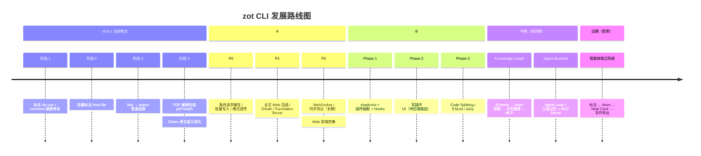

# 路线图

当前版本目标与未来方向。历史迭代见 [CHANGELOG.md](../CHANGELOG.md)。



---

## 当前焦点

### v0.0.x — Agent 可用性增强（进行中）

不大幅扩张命令面，聚焦三件事：**写操作安全性**、**多模态能力**、**体验打磨**。

#### 执行顺序

| 阶段 | 内容 | 状态 |
|------|------|------|
| 1 | 标注 `--dry-run` 预览模式 + comment 截断修复 | 待开始 |
| 2 | 批量标注（`--from-file` JSON 驱动） | 待开始 |
| 3 | `find` → `export` 管道连接（`--from-find`） | 待开始 |
| 4 | PDF 健康检查（`pdf-health`） | 待开始 |

> **本版不做**：local FTS 增强 / MCP server / 大规模命令扩张 / 非笔记非关联类型的本地写入

#### 标注系统优化

| 优先级 | 改进项 | 说明 | 阻塞阶段 |
|--------|--------|------|----------|
| **P0** | `--dry-run` 预览模式 | 仅返回匹配结果，不执行写入 | 阶段 1 |
| **P0** | comment 截断去除 | Python 脚本 `comment[:200]` 硬截断 | 阶段 1 |
| **P1** | 批量标注 `--from-file` | JSON 数组驱动多条标注点 | 阶段 2 |
| **P2** | 标注前 PDF 快照 | `--clear` 前自动备份 | 阶段 3+ |
| **P2** | 匹配上下文展示 | 返回匹配文本前后 N 字符 | 阶段 2 |

#### PDF 健康检查（`pdf-health`）

扫描 storage/ PDF 文件名，检测命名问题并给出修复建议。详见 [optimizations/pdf-health.md](./optimizations/pdf-health.md)。

| 检查项 | 规则 | 严重度 |
|--------|------|--------|
| 文件名过长 | basename > 200 字符 | Critical |
| 非法字符 | `\ / : * ? " < > \|` | Critical |
| 连续空格 / 首尾空格 | 2+ 空格或首尾空白 | Warning |
| 无 `.pdf` 扩展名 | 缺少后缀 | Warning |
| 无意义命名 | `download(`、`Copy of`、纯数字等 | Info |
| 重复文件名 / 文件缺失 | 同 key 目录同名或 DB 指向不存在 | Error |

---

## 下一阶段（并行方向）

### A. Zotero 原生能力深化

详细方案见 [native-integration.md](./optimizations/native-integration.md)。

| 优先级 | 方向 | 预期收益 |
|--------|------|----------|
| **P0** | 条件请求缓存 (`If-Modified-Since-Version`) | 未变更数据零网络开销 |
| **P0** | 批量写入合并（单次最多 50 对象） | O(n) → O(n/50) |
| **P0** | 导出格式透传（20+ 格式） | 无需本地实现格式转换 |
| **P1** | Full-text Content API（Web 回退全文检索） | hybrid 完整性 |
| **P1** | OAuth 授权流程（替代手动 API Key） | 一键授权 |
| **P1** | Translation Server 对接（URL → 元数据） | 自动提取元数据 |
| **P2** | WebSocket 实时推送 / 完整同步协议 | 高复杂度，长期方向 |

### B. Web 前端完善

MVP 已交付（v0.0.6），体验打磨已完成（v0.0.7：Skeleton / Toast / PdfViewer 懒加载）。剩余演进：

| 阶段 | 内容 | 状态 |
|------|------|------|
| 1 | shadcn/ui 初始化 + 组件抽取 + 自定义 Hooks | 待开始 |
| 2 | 写操作 UI（条目 CRUD 弹窗、标签/收藏夹管理） | ⏸ 后端路由待注册 |
| 3 | 性能与工程化（Code Splitting / ESLint / a11y / 列表虚拟化） | 待开始 |

> CLI 层笔记创建已支持 hybrid 写入（v0.0.8）；前端写操作 UI 需先完成 handlers.go 路由注册。

### 性能基线

详见 [performance-baseline.md](../reference/performance-baseline.md)。限流方案见 [rate-limiting.md](./optimizations/rate-limiting.md)。

| 命令 | 当前耗时 | 优化目标 |
|------|----------|----------|
| export | ~19s | < 5s |
| show | ~8s | < 3s |
| find / collections | 0.3-0.5s | 保持 |

---

## 中期：知识图谱与智能体基础设施（未排期）

### Knowledge Graph — [详细设计](./knowledge-graph.md)

| 阶段 | 内容 |
|------|------|
| P0 | Schema 定义 + GraphStore 接口（SQLite 图存储） |
| P1 | 标注→Atom 自动提取 |
| P2 | 关系推理 + 置信度评分 |
| P3 | MCP Resource 映射 |

### Agent Runtime — [详细设计](./agent-runtime.md)

Agent Loop（PERCEIVE→THINK→ACT→CHECK）+ 三层记忆 + Behavior Rules + MCP Server。

---

## 远期：智能体笔记系统（愿景）

以 **Annotation Atom 为核心** 的半自动化学术写作辅助：

```
PDF 标注 → Atom（最小知识单元）→ Note Card → Literature Review Chapter
```

核心能力：Atom 提取引擎 / LLM 智能分类 / 笔记模板 / 跨条目关联 / 写作导出。

设计约束：不替代 Zotero 笔记编辑器 · 人机协作优先 · 本地优先 · 格式中立。
