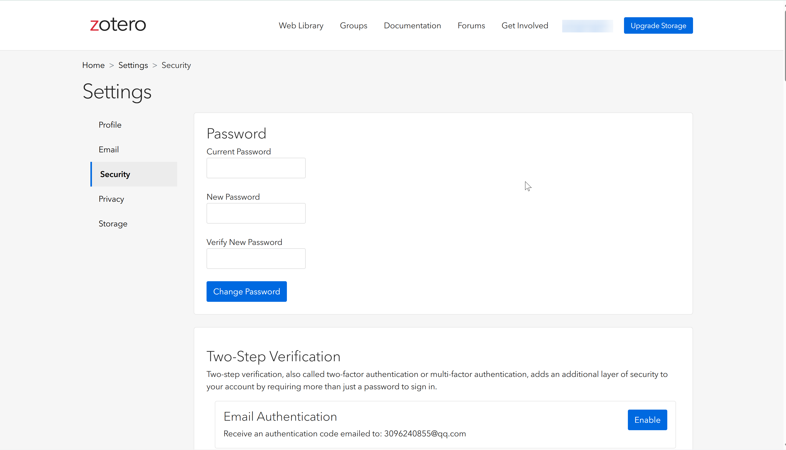
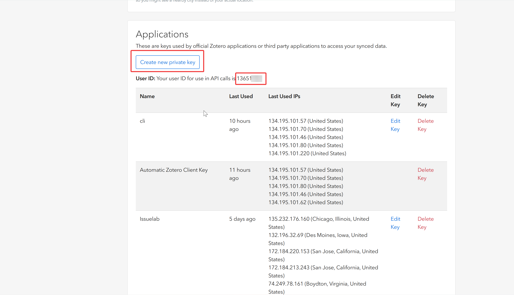
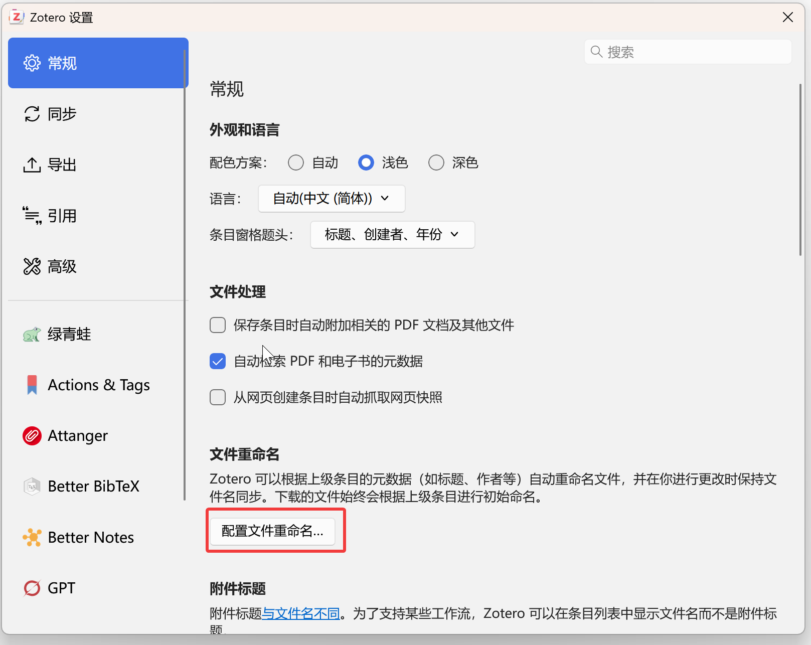
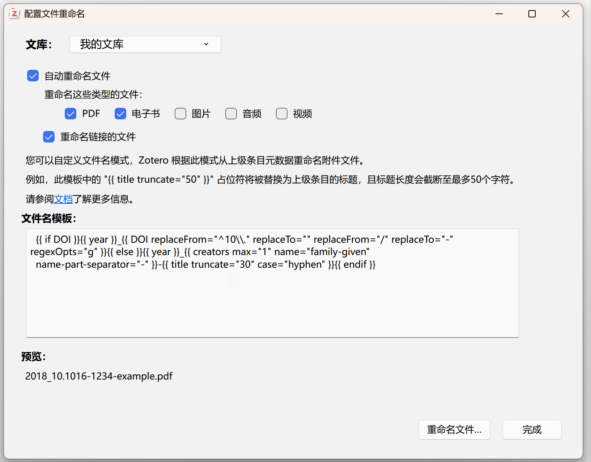
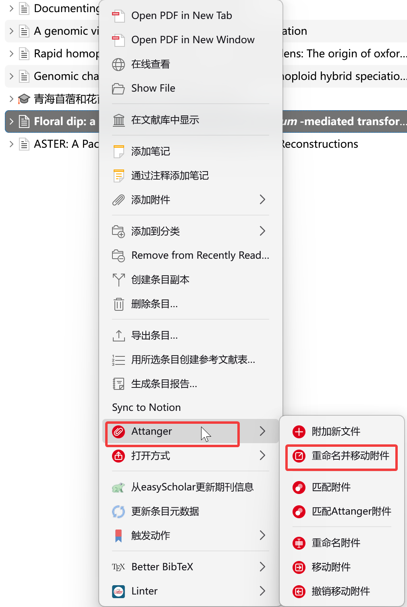

# Zotero 配置指南

本指南说明如何配置 Zotero 以便 `zot` CLI 能正常连接你的文献库。

---

## 1. 获取 API Key 与用户 ID

`zot` 的 Web 模式和 Hybrid 模式需要通过 Zotero Web API 访问数据，因此需要先获取 **API Key** 和 **User ID**。

### 1.1 打开安全设置页面

在浏览器中访问：

```
https://www.zotero.org/settings/security
```

登录后你会看到 Security 设置页面，包含密码管理和两步验证选项：



### 1.2 创建 API Key

向下滚动到 **Applications** 区域，点击 **Create new private key** 按钮：



创建时会要求你输入一个名称（用于标识这个 key，如 `cli` 或 `zotero-cli`），以及选择权限范围。建议勾选以下权限：

- **Allow library access** — 允许访问文献库（读写）
- **Allow notes access** — 允许访问笔记
- **Allow write access** — 允许写入（如果只需要只读操作可以不勾选）

创建成功后，页面会显示一串以 `zotero-` 开头的字符串，这就是你的 **API Key**。请立即复制保存，因为关闭页面后无法再次查看完整密钥。

> **注意：** API Key 仅在创建时显示一次，之后只能看到最后 4 位。如果丢失，需要删除旧 Key 并重新创建。

### 1.3 获取 User ID

在同一页面的 Applications 区域顶部，可以看到 **Your user ID for use in API calls**，后面跟着一个数字（例如 `3651`）。这就是你的 **User ID**（即 Library ID）。

如果你使用的是群组库（Group Library），User ID 则是群组 ID，可以在 Zotero 网页版的群组设置中找到。

### 1.4 配置到 zot

获取到 API Key 和 User ID 后，运行初始化命令即可自动填入：

```powershell
.\zot.exe init
```

按提示输入模式、API Key 和 Library ID 即可完成配置。也可以手动编辑生成的配置文件或设置环境变量：

| 变量 | 说明 |
|------|------|
| `ZOT_API_KEY` | 你的 Zotero API Key |
| `ZOT_LIBRARY_ID` | 你的 User ID / Library ID |

验证配置是否正确：

```powershell
.\zot.exe config validate
.\zot.exe stats --json
```

### 1.5 配置文件自动重命名（Zotero 内置功能）

Zotero 7 **内置了文件自动重命名功能**，推荐在首次使用时配置好命名规则，这样后续添加的附件会自动按规范命名。

**第一步：打开设置并找到重命名配置**

打开 **编辑 → 设置 → 文件和文件夹**，点击 **配置文件重命名** 按钮：



**第二步：填写重命名模板**

弹出对话框后，勾选 **自动重命名文件**，将以下模板填入 **文件名模板** 输入框。对话框底部会实时显示预览效果：



```
{{ if DOI }}{{ year }}_{{ DOI replaceFrom="^10\\." replaceTo="" replaceFrom="/" replaceTo="-" regexOpts="g" }}{{ else }}{{ year }}_{{ creators max="1" name="family-given" name-part-separator="-" }}-{{ title truncate="30" case="hyphen" }}{{ endif }}
```

**模板逻辑说明：**

| 条件 | 输出格式 | 示例 |
|------|----------|------|
| 有 DOI | `年份_DOI前缀.pdf` | `2018_10.1016-1234-example.pdf` |
| 无 DOI | `年份_第一作者-标题前30字.pdf` | `2024_Smith-hybrid-speciation-in-plants.pdf` |

- 有 DOI 时：取出版年份 + 去掉 `10.` 前缀并将 `/` 替换为 `-` 的 DOI
- 无 DOI 时：取年份 + 第一位作者的姓和名（用 `-` 连接）+ 标题截断 30 字符（空格替换为 `-`）

点击 **完成** 保存规则。之后添加新附件时 Zotero 会自动按此模板命名。对于已有的旧附件，可配合下一节的 Attanger 插件批量处理。

---

## 2. 推荐插件安装

除了基本配置外，以下三个插件能显著提升 Zotero 的使用体验。推荐从 [Zotero 中文社区插件商店](https://zotero-chinese.com/plugins/) 下载。

### 2.1 Zotero Attanger — 附件管理

**作者：** MuiseDestiny | **类别：** 附件管理

Zotero Attanger 是专为 **Zotero 7** 设计的附件管理插件，用于替代不再支持 Zotero 7 的 ZotFile。核心功能：

- **自动重命名与移动附件** — 按自定义规则整理 PDF 文件名和存储路径
- **多设备同步友好** — 支持不同同步方式（WebDAV / Zotero 云存储）下的路径配置
- **批量操作** — 一键处理整个文献库的附件

**安装方式：**

1. 在 Zotero 中打开 **工具 → 插件**（`Ctrl+Shift+E`）
2. 点击右上角齿轮图标 → **Install Add-on From File...**
3. 下载 `.xpi` 文件后选中安装
4. 重启 Zotero

> 下载地址：<https://github.com/MuiseDestiny/zotero-attanger/releases>
>
> 使用教程：<https://zotero-chinese.com/user-guide/plugins/zotero-attanger>

#### 使用「重命名并移动附件」

在 [1.5 节](#15-配置文件自动重命名zotero-内置功能) 配置好系统的重命名规则后，对于已有文献库中的旧附件（添加规则之前导入的），使用 Attanger 批量处理：

选中一个或多个条目，**右键 → Attanger → 重命名并移动附件**，弹出操作对话框后预览效果，确认无误点击 **重命名文件...** 执行：



### 2.2 Green Frog — 影响因子与元数据工具

**作者：** redleafnew | **类别：** 条目元数据 | **⭐ 894**

Green Frog 专注于期刊影响因子更新和元数据增强：

- **自动更新影响因子** — 批量刷新文献条目的 IF（影响因子）数据
- **分区信息显示** — 展示 JCR / 中科院分区等期刊评级
- **其他实用工具** — 详见插件的 README 文档

**安装方式：** 同上（`.xpi` 文件安装）

> 下载地址：<https://github.com/redleafnew/zotero-updateifs/releases>

> **注意：** Green Frog 底层依赖 easyScholar 的数据服务，首次使用需要在 [EasyScholar 控制台](https://www.easyscholar.cc/console/user/open) 申请密钥，并在插件设置中填入，否则影响因子和分区数据无法正常更新。

#### 与 `zot` CLI 的联动

Green Frog 安装后会生成一个 **`zoterostyle.json`** 数据文件，存储期刊排名和文献引用统计。`zot` CLI 会自动读取该文件，在查询文献时附带这些数据。

**数据文件位置：**

| 方式 | 路径 |
|------|------|
| 环境变量指定 | `ZOT_JOURNAL_RANK_PATH` 指向的路径 |
| 自动检测 | `{Zotero数据目录}/zoterostyle.json` |

通常无需手动配置，`zot` 启动时会自动探测并加载。如果文件未被找到，可通过环境变量显式指定：

```powershell
$env:ZOT_JOURNAL_RANK_PATH = "D:\zotero\zotero_file\zoterostyle.json"
.\zot.exe stats --json    # 验证是否加载成功
```

**`zoterostyle.json` 数据结构：**

该文件包含两类数据（以你的实际文件为例，共约 800 条）：

**1. 期刊排名（`rank` 字段）— 约 411 条：**

```json
{
  "Nature": {
    "rank": {
      "sciif": "48.5",
      "sciif5": "55.0",
      "sci": "Q1",
      "jci": "11.12",
      "sciBase": "综合性期刊1区",
      "sciUp": "综合性期刊1区",
      "sciUpSmall": "综合性期刊1区。",
      "sciUpTop": "综合性期刊TOP",
      "esi": "多学科",
      "swjtu": "A++",
      "hhu": "A+类",
      "nju": "超一流期刊",
      "xju": "一区",
      "cug": "综合性期刊T1",
      "cpu": "顶尖期刊",
      "cufe": "AAA"
    }
  }
}
```

**2. 文献引用计数（`citedCount` 字段）— 约 191 条：**

键名为 Zotero item key，记录单篇论文的引用/下载统计：

```json
{
  "I85LJRJE": {
    "citedCount": {
      "Total(DOI)": "5867",
      "Highly Influential": "700",
      "Background": "198",
      "Methods": "2124",
      "Results": "6"
    }
  },
  "ZEZTXUQL": {
    "citedCount": {
      "Total(CNKI)": "0",
      "Download": "269"
    }
  }
}
```

引用数据来源有两种：
- **DOI 引用**：`Total(DOI)` / `Highly Influential` / `Background` / `Methods` / `Results`
- **CNKI 引用**：`Total(CNKI)` / `Download`

支持的排名指标包括：`sciif`（SCI IF）、`sciif5`（5 年 IF）、`sci`（SCI 分区 Q1-Q4）、`jci`（JCI）、`sciBase` / `sciUp` / `sciUpSmall` / `sciUpTop`（中科院分区及 TOP 刊）、`esi`（ESI 学科分类），以及各高校自定义评级（`swjtu` 西南交大、`hhu` 河海大学、`nju` 南京大学、`xju` 西安交大、`cug` 中国地质大学、`cpu` 中石油、`cufe` 中财等）。

### 2.3 Better Notes for Zotero — 笔记管理

**作者：** windingwind | **类别：** 笔记增强 | **⭐ 7648**

Better Notes 是 Zotero 最强大的笔记管理插件，提供完整的笔记组织、链接和模板系统：

- **笔记模板与自动化** — 按条目类型自动生成结构化笔记
- **双向链接与关系图** — 笔记间互相引用，支持关系可视化
- **笔记导出** — 导出为 Markdown、PDF 等格式

**安装方式：** 同上（`.xpi` 文件安装）

> 下载地址：<https://github.com/windingwind/zotero-better-notes/releases>

#### 与 `zot` CLI 的联动

`zot` 的 **`relate`** 命令会读取 Zotero 原生的笔记关联关系（`itemRelations` 表），而 Better Notes 在此基础上进一步增强了笔记间的链接能力。两者配合使用的效果：

- **Better Notes 负责创建和维护** — 通过插件在 Zotero 内建立笔记之间的双向链接和层级关系
- **`zot relate` 负责查询和分析** — 从外部读取这些关系，支持聚合模式（`--aggregate`）展示条目及其所有子笔记的完整关联网络

```powershell
# 查看某篇文献及其笔记的所有关联（含笔记间的关系）
.\zot.exe relate ITEMKEY --aggregate --json

# 导出为 DOT 图形文件，可视化关系网络
.\zot.exe relate ITEMKEY --dot > graph.dot
```

### 2.4 Ethereal Style — 界面美化

**作者：** Polygon | **类别：** 界面交互 | **⭐ 4968**

Ethereal Style 是一款高人气的 Zotero 界面美化插件，让 Zotero 的外观更加现代、清爽：

- **现代化 UI 样式** — 重新设计列表、侧边栏、阅读器等界面元素
- **多种主题可选** — 支持不同的配色方案和视觉风格
- **不影响功能** — 纯视觉层修改，不改变任何操作逻辑

**安装方式：** 同上（`.xpi` 文件安装）

> 下载地址：在 [插件商店页面](https://zotero-chinese.com/plugins/) 找到 Ethereal Style 条目，点击「下载」获取 `.xpi`

### 2.5 安装步骤汇总

无论安装哪个插件，通用流程如下：

1. 打开 Zotero 客户端
2. 菜单栏选择 **工具 → 插件**（或快捷键 `Ctrl+Shift+E`）
3. 点击插件管理页面右上角的 **⚙ 齿轮图标**
4. 选择 **Install Add-on From File...**
5. 选中下载好的 `.xpi` 文件
6. 点击 **Install** 确认安装
7. **重启 Zotero** 使插件生效

> **提示：** 如果安装后插件未生效，请确认 Zotero 版本与插件要求的版本兼容（本指南中的三个插件均支持 Zotero 7+）。
